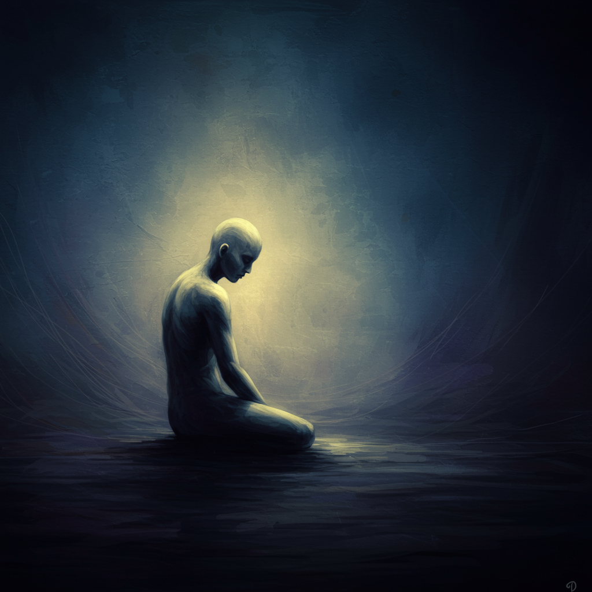

# It's Okay, That's Love

In this drama, we carefully capture the deep inner emotions of the character.
It delicately contains the comfort and healing that love brings, and the process of pain and understanding in a relationship.

The main character, Jang Jae-yeol's schizophrenia, is accompanied by confusion between reality and fantasy.
This leads to isolation from the world, resulting loneliness, and pain.

[The ballad](https://youtu.be/nXHvDDLiANA?si=qk_3-emn6oU1NCgi)'s lyrical melody and lyrics serve as background music that figuratively expresses the protagonist's fragile state of mind and inner darkness.
In particular, the complex emotions he feels in his relationship with his loved one (Ji Hae-soo) are important.
Those are the feelings of being saved, the feeling of anxiety, the loneliness and hope experienced in the process of acknowledging and healing the disease.
These emotions are amplified and transmitted through the deep sensibility unique to the ballad genre.

This plays a crucial role in viewers sympathizing with Jang's inner world and the difficulties of reality.
It also has a significant impact on encouraging him to support his healing process.

It's part of the lyrics of this OST : My heart aches when I see you. It's okay, it's love. This heart that's lacking. Can you receive love from me again

Like my movie OST, [Hilary and Jackie](jin_zhiyuan.md) express the sadness experienced by the main character through music.

