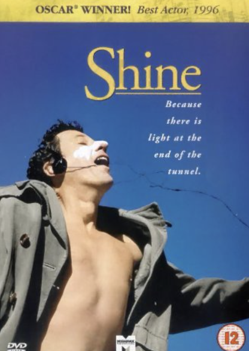

---  
Year: 1996  
Genre: Film  
Creator: Scott Hicks  
Disease: Bipolar Disorder  
ICD: F31.2
Music: Piano Concerto No. 3 in D Minor  
Composer: Sergei Rachmaninoff  
Type: Classical
---  
Shine: The Sound of Bipolarity  

Rachmaninoff's concerto structurally mirrors bipolar disorder's dual phases:  
 Manic escalation  
   - Rapid arpeggios (BPM≥160) and fortissimo brass sections sonify racing thoughts  
   - Cadenza's technical demands  

 
---

장례식에서 연주되길 희망하는 음악

음악: [라흐마니노프 - 보칼리제]https://www.youtube.com/watch?v=JCJO-GU6ThM

선정 이유:  이 곡은 영화에서 데이비드가 병원에서 나온 후 처음 공연한 음악입니다.  빠른 템포는 인생의 힘든 순간들을, 아름다운 멜로디는 희망을 상징합니다.  "고통을 이겨낸 자만이 전할 수 있는 위로"를 담고 있습니다.  
---
질병서사 

점심 식사 후 찾아오는 복통과 밤마다 찾아오는 속쓰림이 일상이 되었어요. 이런 순간엔 [바흐의 G선상의 아리아](https://youtu.be/pzpYMcLtX5I)를 들으며 편안하게 앉아 있습니다. 현악기의 부드러운 선율이 경련하는 위장을 달래주고, 54BPM의 안정된 리듬이 소화기관의 움직임을 조화롭게 도와줍니다. 영화 <샤인>에서 데이비드가 피아노로 정신적 고통을 이겨냈듯, 이 음악은 제 위장이 내는 신호를 평화로운 리듬으로 바꾸는 특별한 호흡법입니다. "몸이 불편해도 음악은 언제나 편안함을 선사한다"는 믿음이 이제 제 일상의 위로가 되었습니다.

